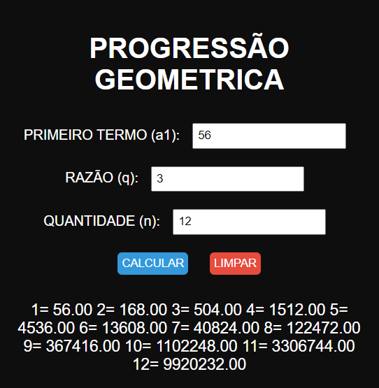

# CALCULAR PG
🆎CALCULADORA DE PG EM HTML, CSS E JS.

 <br>

## DESCRIÇÃO:
A "Progressão Geométrica" é uma aplicação que permite calcular os termos de uma progressão geométrica com base no primeiro termo (a₁), na razão (q) e na quantidade de termos (n) fornecidos pelo usuário. Abaixo estão os principais recursos implementados:

1. Calcular Termos da PG:
   - Ao clicar no botão "CALCULAR", o sistema calcula os termos da progressão geométrica com base nos valores fornecidos pelo usuário para o primeiro termo (a₁), a razão (q) e a quantidade de termos (n).

2. Limpar Resultado:
   - Ao clicar no botão "LIMPAR", todos os campos de entrada são limpos e o resultado do cálculo é removido da visualização.

## COMO USAR?
### BAIXANDO O PROJETO:
* Clone o repositório para o seu sistema local:

```bash
git clone https://github.com/VILHALVA/CALCULAR-PG.git
```

* Navegue até o diretório do projeto.

```bash
cd CALCULAR-PG
```

* Descompacte o arquivo ZIP (se você baixou manualmente):

```bash
unzip CALCULAR-PG.zip
```

* Abra o arquivo `CODIGO.html` em seu navegador de preferência.

### EXECUTANDO O PROJETO:
1. Informar os Valores:
   - Insira o valor do primeiro termo (a₁) no campo "PRIMEIRO TERMO (a₁)".
   - Insira o valor da razão (q) no campo "RAZÃO (q)".
   - Insira a quantidade de termos desejada (n) no campo "QUANTIDADE (n)".

2. Calcular Termos:
   - Após inserir os valores, clique no botão "CALCULAR" para calcular os termos da progressão geométrica.

3. Visualizar Resultado:
   - O sistema exibirá os termos da progressão geométrica calculados com base nos valores fornecidos.

4. Limpar Resultado:
   - Se desejar recomeçar o processo, clique no botão "LIMPAR" para limpar os campos de entrada e remover o resultado do cálculo da visualização.

## NÃO SABE?
- Entendemos que para manipular arquivos em `HTML`, `CSS` e outras linguagens relacionadas, é necessário possuir conhecimento nessas áreas. Para auxiliar nesse aprendizado, oferecemos cursos gratuitos disponíveis:
* [Curso de HTML e CSS](https://github.com/VILHALVA/CURSO-DE-HTML-E-CSS)
* [Curso de JavaScript](https://github.com/VILHALVA/CURSO-DE-JAVASCRIPT)
* [Confira mais cursos](https://github.com/VILHALVA?tab=repositories&q=+topic:CURSO)

## CREDITOS:
- [PROJETO CRIADO PELO VILHALVA](https://github.com/VILHALVA)
- [ESTÁ DISPONIVEL NO SITE](https://vilhalva.github.io/STYLER/STYLER.html)

